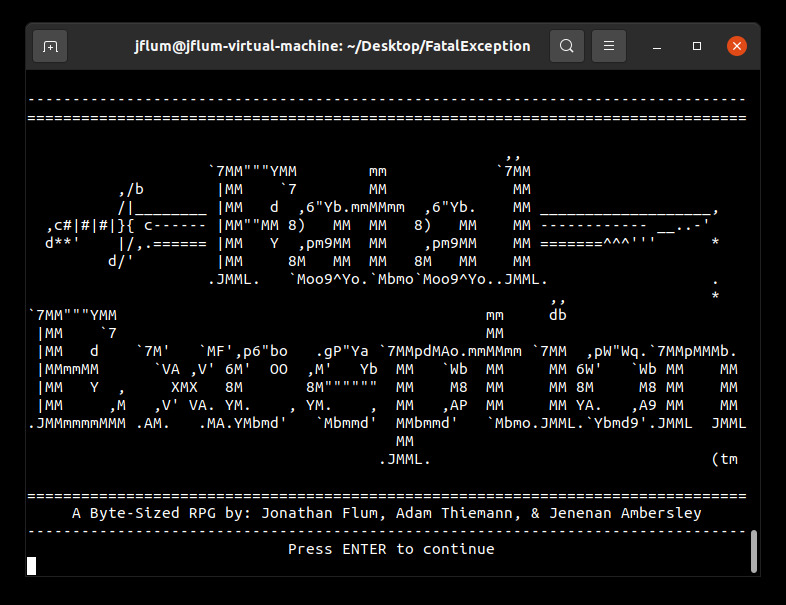
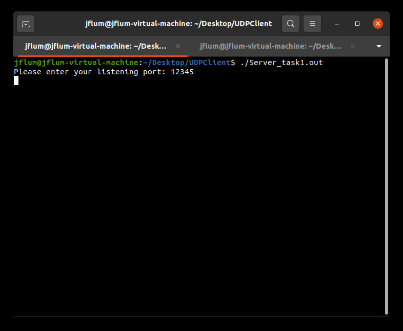

Portfolio
=========

Programming Projects
--------------------

*For access to my private project repositories, please [email me](mailto:jonathan.flum@gmail.com?subject=GitHub%20Access) with the subject line, GitHub Access.

---
### [Fatal Exception | CSCI 325](project1)

---
### [HTML Parser & Web Crawler | CSCI 315](project2)

---
### [The Magic Number | CSCI 301](project3)

---
### [Simple UDP Client | CSCI 332](project4)

---
### Bill of Materials Manager | CSCI 419
---
### Students Against Drunk Deriving | CSCI 334
---
### Battleship (PvC) | CSCI 235
---

Ethics Papers
-------------

### [Dangerous Dave in Copyright Infringement](/pdf/Paper_1_CSCI_301.pdf)

-   **Class:** CSCI 301 - Survey of Scripting Languages 
-   **Grade:** A

### [Malpractice Makes Perfect](/pdf/Paper_2_CSCI_315.pdf)

-   **Class:** CSCI 315 - Data Structure Analysis
-   **Grade:** A

### [Advances Through Impartiality](/pdf/Paper_3_CSCI_332.pdf)

-   **Class:** CSCI 332 - Applied Networking
-   **Grade:** A

---

Presentations
-------------

### [Playstation Network Breach and Outage](/pdf/Presentation_1_CSCI_301.pdf)

- **Class:** CSCI 301 - Survey of Scripting Languages 
- **Grade:** A
- [Watch on YouTube](https://youtu.be/nxjtsQdpTRY)

### [Ethics in Computer Benchmarking](/pdf/Presentation_2_CSCI_209.pdf)

- **Class:** CSCI 209 - Introduction to Computers
- **Grade:** A

---

Page template forked from <a href="https://github.com/csu-cs/csci-portfolio">CSU-CS</a>

<!-- Remove above link if you don't want to attributive -->
