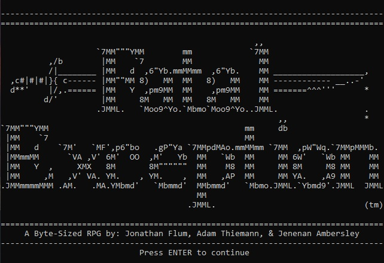
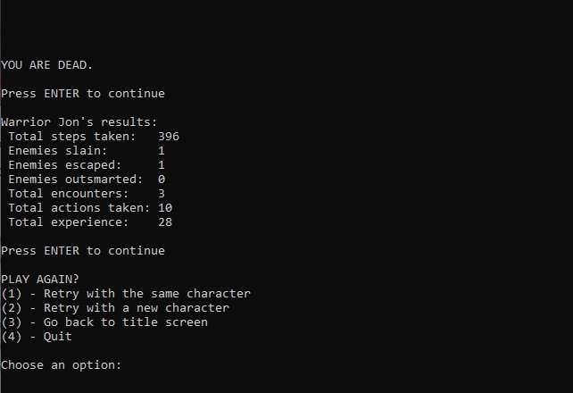

[Back to Portfolio](./)

Fatal Exception
===============

-   **Class:** CSCI 325 - Object-Oriented Programming
-   **Grade:** A
-   **Language(s):** Java
-   **Source Code Repository:** [features/mastering-markdown](https://guides.github.com/features/mastering-markdown/)  
    (Please [email me](mailto:example@csustudent.net?subject=GitHub%20Access) to request access.)

## Project description

Fatal Exception is an interactive, text based adventure game that provides the user with a bite-sized role playing experience where danger lurks around every corner. Take advantage of player customization and build your hero as a warrior, a mage, or even a thief! Battle ferocious foes and menacing monsters in your quest to defeat the endless tormenter: Infinite Loop. Every playthough requires a different strategy—will you survive and claim untold riches and glory, flee to fight another day, or succumb to your peril?

## How to compile and run the program

```bash
cd FatalException
javac src/fatalexception/*.java -d ./
java src/fatalexception/FatalException
```

## UI Design

Almost every program requires user interaction, even command-line programs. Include in this section the tasks the user can complete and what the program does. You don't need to include how it works here; that information may go in the project description or in an additional section, depending on its significance.

Lorem ipsum dolor sit amet (see Fig 1), consectetur adipiscing elit, sed do eiusmod tempor incididunt ut labore et dolore magna aliqua. Ut enim ad minim veniam, quis nostrud exercitation ullamco laboris nisi ut aliquip ex ea commodo consequat (see Fig 2). Duis aute irure dolor in reprehenderit in voluptate velit esse cillum dolore eu fugiat nulla pariatur. Excepteur sint occaecat cupidatat non proident, sunt in culpa qui officia deserunt mollit anim id est laborum (see Fig 3).

  
Fig 1. Fatal Exception's launch screen.

  
Fig 2. A difficult encounter, narrowly escaped.

  
Fig 3. Failure screen with game results.

## 3. Additional Considerations

Minimum requirements: JDK14 (v58.0 class files). 
```bash
sudo apt install openjdk-17-jdk-headless
```

Best displayed in an 80 by 28 terminal with word wrapping disabled.


[Back to Portfolio](./)
