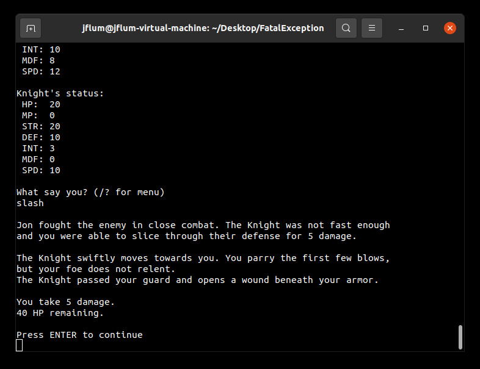

[Back to Portfolio](./)

Fatal Exception
===============

-   **Class:** CSCI 325 - Object-Oriented Programming
-   **Grade:** A
-   **Language(s):** Java
-   **Contributors:** 
    - Jonathan Flum - Concept Design, Player and Enemy character classes, primary game loop, menuing system 
    - Adam Thiemann - Project Coordinator, Encounter and Statistics classes, gameplay balancing, RNG modifiers 
    - Jenean Ambersley - Some narrative elements (withdrew early in development)
-   **Source Code Repository:** [features/mastering-markdown](https://guides.github.com/features/mastering-markdown/)  
    (Please [email me](mailto:example@csustudent.net?subject=GitHub%20Access) to request access.)

## Project description

Fatal Exception is an interactive, text based adventure game that provides the user with a bite-sized role playing experience where danger lurks around every corner. Take advantage of player customization and build your hero as a warrior, a mage, or even a thief! Battle ferocious foes and menacing monsters in your quest to defeat the endless tormenter: Infinite Loop. Every playthough requires a different strategy—will you survive and claim untold riches and glory, flee to fight another day, or succumb to your peril?

## How to compile and run the program

```bash
cd ./FatalException
javac ./src/fatalexception/*.java -d ./
java fatalexception/FatalException
```

## UI Design

Upon launching the game, players are greeted by a foreboding title screen (Fig. 1), followed immediately by the main menu after any key press. Here, the user can select to begin a new quest, view the readme or credits, or simply exit the program. First, let’s select the readme option (Fig. 2) in order to gain an orientation to the various gameplay mechanics, as well as receive some strategic advice.

  
*Figure 1. Fatal Exception's launch screen.*

  
*Figure 2. Game preface, stats key, and general mechanics are displayed from the main menu.*

Returning to the main menu after continuing, this time we’ll select “New Quest” and make some initial decisions about our character (Fig. 3). There are three main classes to choose from, each with their own strengths, weaknesses, and unique play style. For the purposes of this demonstration, I’ve selected “Warrior,” and provided a character name.

  
*Figure 3. New Quest sequence, including class selection and character naming.*

Following a brief story prologue, we’ve encountered our first enemy (Fig. 4). Similar to the player’s statistics, the enemies throughout this game also have their strengths and weaknesses; we’ll need to select an action that has the best probability for success by careful evaluation. Available actions can be displayed in the help menu (Fig. 5).

  
*Figure 4. An early enounter with a low-level, physically weak enemy.*

  
*Figure 5. Encounter action menu, describing the available strategic options.*

This particular baddie is a low-level demon, but has high intelligence. Trying to outsmart this enemy type would likely fail (his INT is 20, whereas ours is 5). Likewise, our SPD stats are similar and escaping may or may not be successful. However, our STR is much higher than his DEF, therefore we should be able to perform an effective physical attack. Let’s try a slash (Fig. 6).

  
*Figure 6. A 'slash' is performed, resulting in encounter success and gained experience.*
 
The slash dealt 11 damage, defeating the enemy (who only had 10 HP). We also gained experience, in the form of stat boosts, commensurate with the difficulty of the encounter. Note that higher level enemies will usually take several volleys to defeat, while also countering with their own actions (Fig. 7). 

  
*Figure 7. Exchanging blows during an encounter that spans many rounds.*

Progressing through the game, typographical mistakes may occur and input validation exists for that very reason, as I’ve unintentionally demonstrated (Fig. 8). On the other hand, mistakes made in action decisions/strategy are not as forgiving; if your HP falls to 0, the game is over (Fig. 9). 

  
*Figure 8. Accidental demonstration of input validation.*

  
*Figure 9. A high-level enemy attack that results in the premature end to your quest.*

Upon defeat, a results screen is displayed, summarizing your adventure; additional options are also provided so that you may retry with either the same character, or perhaps a new build (Fig. 10). However, survive for long enough and you will ultimately encounter the game’s final boss, who lacks a true weakness. It will be the actions you have made along the way and the experience your character has gained that will determine your fate (Fig. 11) ...unless you use the debug mode character class, as I have, to reliably reach this point in the game.

  
*Figure 10. End of play results screen, displaying quest statistics. Retry options are also presented.*

  
*Figure 11. The final enounter of the game, reached via a developer mode.*

## Additional Considerations

Minimum requirements: JDK14 (v58.0 class files). 
```bash
sudo apt install openjdk-17-jdk-headless
```

Best displayed in an 80 column, 28 row terminal with word wrapping disabled.
```bash
sudo apt install xterm
resize -s 28 80
setterm -linewrap off
```

[Back to Portfolio](./)
