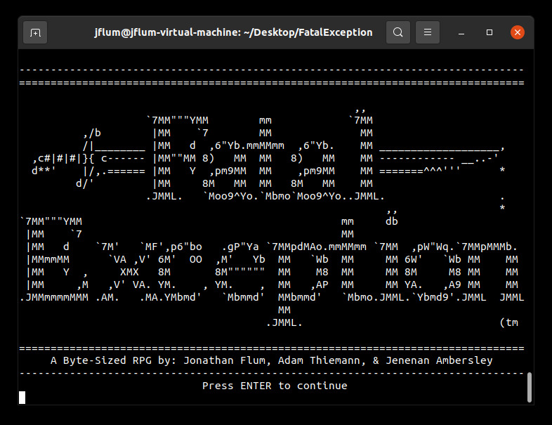

[Back to Portfolio](./)

Fatal Exception
===============

-   **Class:** CSCI 315 - Data Structure Analysis
-   **Grade:** A
-   **Language(s):** C++
-   **Source Code Repository:** [features/mastering-markdown](https://guides.github.com/features/mastering-markdown/)  
    (Please [email me](mailto:example@csustudent.net?subject=GitHub%20Access) to request access.)

## Project description

The HTML Parser & Web Crawler program, as its name would indicate, parses webpages in order to determine if the HTML contained within each file is proper and balanced, i.e., each tag is valid markup and begins and ends at the same depth. If so, the page is crawled, identifying the number of unique, valid links that can be visited, which likewise, are then parsed and crawled in a recursive manner. This program was designed to be light-weight, taking advantage of the stack and queue data structures’ efficiency.

## How to compile and run the program

```bash
cd ./HTMLParseCrawl
make
./html-test pages/*.html
```

## UI Design

Upon launching the game, players are greeted by a foreboding title screen (Fig. 1), followed immediately by the main menu after any key press. Here, the user can select to begin a new quest, view the readme or credits, or simply exit the program. First, let’s select the readme option (Fig. 2) in order to gain an orientation to the various gameplay mechanics, as well as receive some strategic advice.

  
*Figure 1. Fatal Exception's launch screen.*

## Additional Considerations

Minimum requirements: GNU Compiler Collection (GCC) version 9.3.0.  
```bash
sudo apt update
sudo apt install build-essential
```

Note: Parsing and crawling live webpages/websites is out of scope and therefore not tested.

[Back to Portfolio](./)
