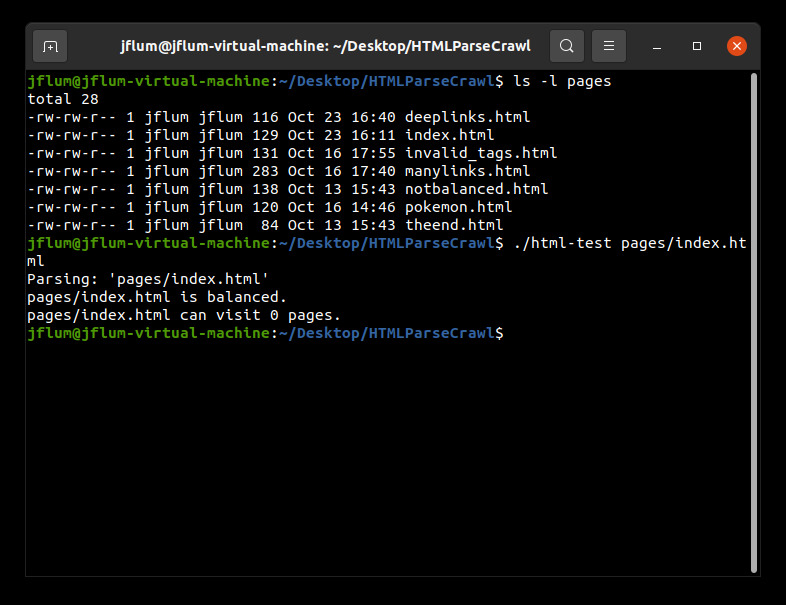
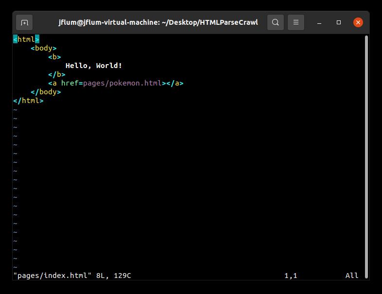
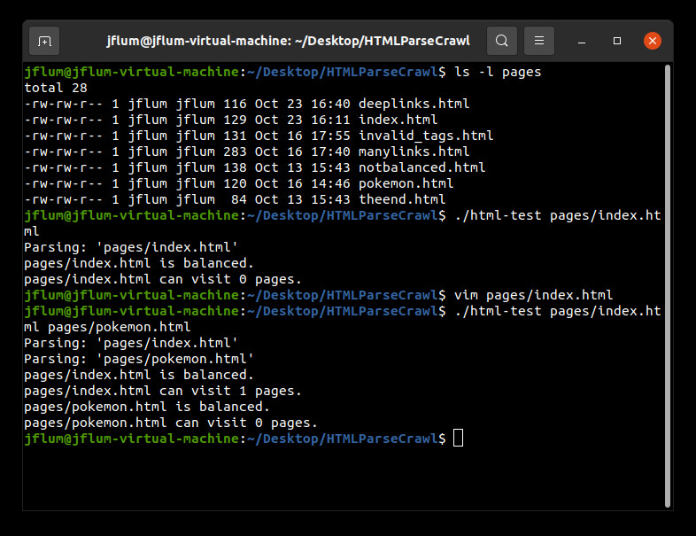
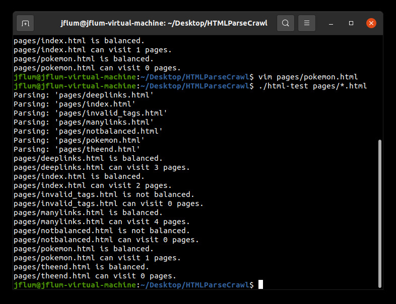

[Back to Portfolio](./)

HTML Parser & Web Crawler
===============

-   **Class:** CSCI 315 - Data Structure Analysis
-   **Grade:** A
-   **Language(s):** C++
-   **Source Code Repository:** [jflum/html_parse_crawl](https://github.com/jflum/html_parse_crawl.git)  
    (Please [email me](mailto:example@csustudent.net?subject=GitHub%20Access) to request access.)

## Project description

The HTML Parser & Web Crawler program, as its name would indicate, parses webpages in order to determine if the HTML contained within each file is proper and balanced, i.e., each tag is valid markup and begins and ends at the same depth. If so, the page is crawled, identifying the number of unique, valid links that can be visited, which likewise, are then parsed and crawled in a recursive manner. This program was designed to be light-weight, taking advantage of the stack and queue data structures’ efficiency.

## How to compile and run the program

```bash
cd ./HTMLParseCrawl
make
./html-test pages/*.html
```

## UI Design

This program accepts either a single HTML page or multiple files as its parameter(s). The directory ‘pages’ contains sample webpages that will be used for demonstration, though any file could be analyzed. Note that parsing and crawling live webpages/websites is out of scope and therefore untested. Let’s begin with one local input; I’ve listed the contents of the ‘pages’ directory and run the program solely specifying the file ‘pages/index.html’ (Fig. 1). The result is that the page is in fact balanced, but cannot visit any other pages. This can be confirmed by viewing the HTML of this simple file directly (Fig. 2). 

  
*Figure 1. A listing of sample HTML pages; program output with 'pages/index.html' as a parameter.*

  
*Figure 2. The contents of the 'index.html' sample file.*

You may notice that while ‘index.html’ contains a syntactically correct link to another page, ‘pokemon.html,’ this page was not included as a parameter, and therefore is invalid (it cannot be visited). Let’s run the program again, but include both files (Fig. 3). We now see an expected output for ‘index.html.’ That is, it can visit the one and only link contained within it. But what about the links subsequent pages could visit? The output here is correct given our input, however we are still not accounting for all recursively visitable pages in this example. 

  
*Figure 3. Program output with 'pages/index.html' and 'pages/pokemon.html as parameters.*

To that extent, and perhaps more usefully, we can also parse and crawl an entire directory (or website). In this case, we’ll execute the program with ‘pages/*.html’ as a parameter (Fig. 4). In contrast to before, we can see that ‘index.html’ is able to visit 2 unique pages of those included as parameters. This is because ‘index.html’ contains a link to ‘pokemon.html’ and ‘pokemon.html’ contains a link to ‘theend.html,’ which contains no hyperlinks. Similar analyses could be conducted for any of the sample files, or HTML pages of your own.  

  
*Figure 4. Program output with 'pages/\*.html' as a parameters.*

## Additional Considerations

Minimum requirements: GNU Compiler Collection (GCC) version 9.3.0.  
```bash
sudo apt update
sudo apt install build-essential
```

[Back to Portfolio](./)
