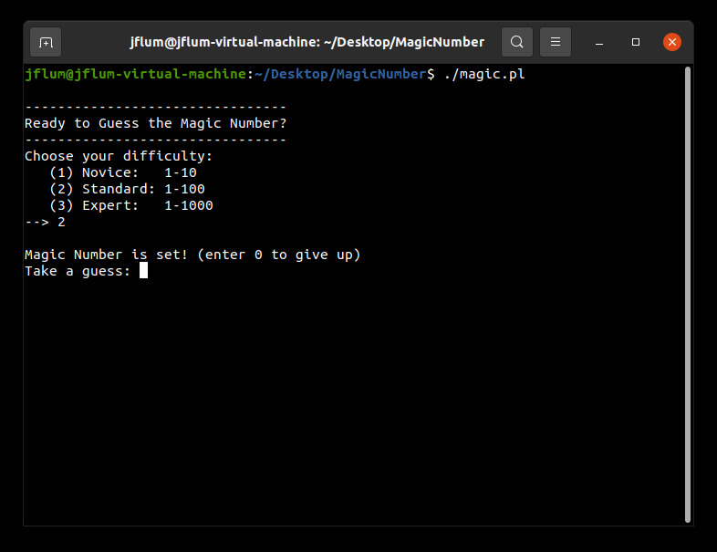
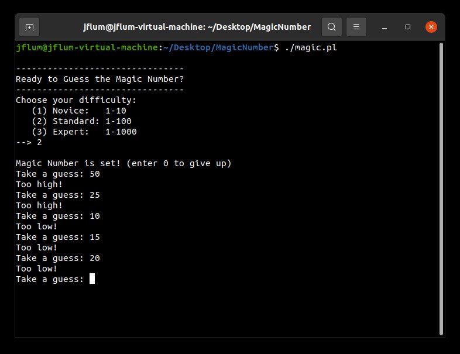
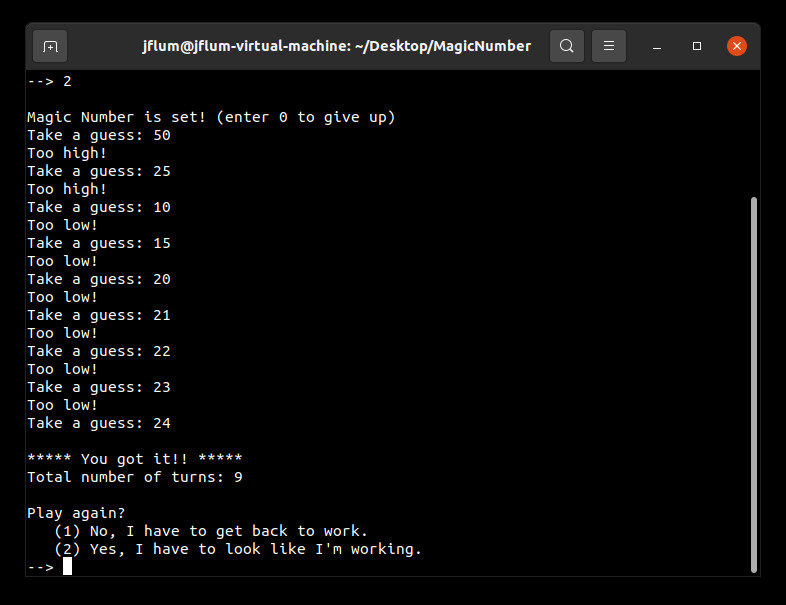

[Back to Portfolio](./)

The Magic Number
===============

-   **Class:** CSCI 301 - Survey of Scripting Languages
-   **Grade:** A
-   **Language(s):** Perl
-   **Source Code Repository:** [jflum/magic_number](https://github.com/jflum/magic_number.git)  
    (Please [email me](mailto:jflum@csustudent.net?subject=GitHub%20Access) to request access.)

## Project description

The Magic Number is a simple game in which you must guess correctly an integer that has been randomly selected from a specified range. If you are incorrect, you will be provided feedback in the form of “too high” or “too low” responses and allowed to guess again. The goal, is of course to identify the magic number, but also to do so in the fewest numbers of turns. 

## How to run the program

```bash
cd ./magic_number-main
chmod u+x magic.pl 
./magic.pl
```

## UI Design

After starting the program, the user is presented with a difficulty selection menu. This sets the range of possible answers. For the purposes of this demonstration, I have selected ‘Standard’ which represents integers 1 through 100 (Fig.1). Note that all answers are non-zero, and thus guessing this value will allow the player to give up. 

  
*Figure 1. Selecting game difficulty (number range).*

Beginning the game, I attempt several guesses, initially halving the possibilities akin to a binary search algorithm. After five tries, I’ve narrowed down the magic number to being greater than 20, but less than 25 (Fig. 2). There is no set approach that must be taken, but this method is fairly efficient. I then solve by sequential input (Fig. 3).

  
*Figure 2. Attempting several guesses, with corresponding feeback.*

  
*Figure 3. The magic number is found, resulting in a success message, total turn display, and retry options.*

Once the magic number has been found, the total number of turns required is presented. In this case it took me 9 guesses, which is average. From here, I can choose to either play again or to quit the program (as seen previously in Fig. 3). Selecting “yes …” to play again allows for a new, perhaps more challenging difficulty to be selected (Fig. 4).

  
*Figure 4. Attempting to correctly guess the 'Expert' difficulty number.*

## Additional Considerations

Minimum requirements: Perl 5 (v5.30.0)
```bash
sudo apt update
sudo apt-get install perl
```

[Back to Portfolio](./)
