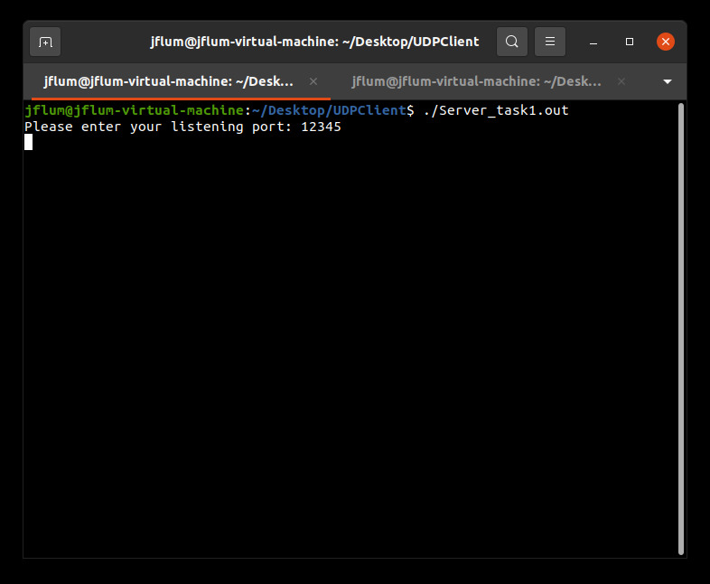
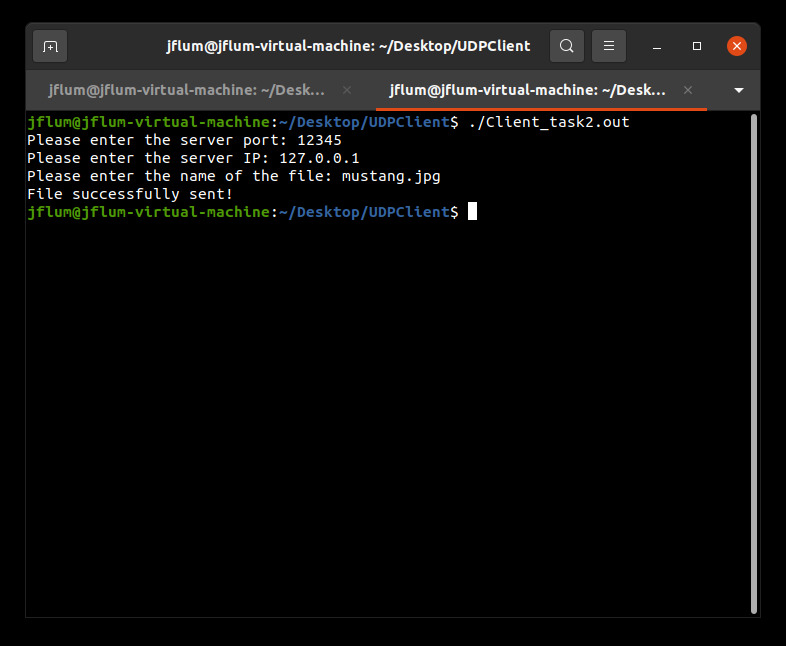
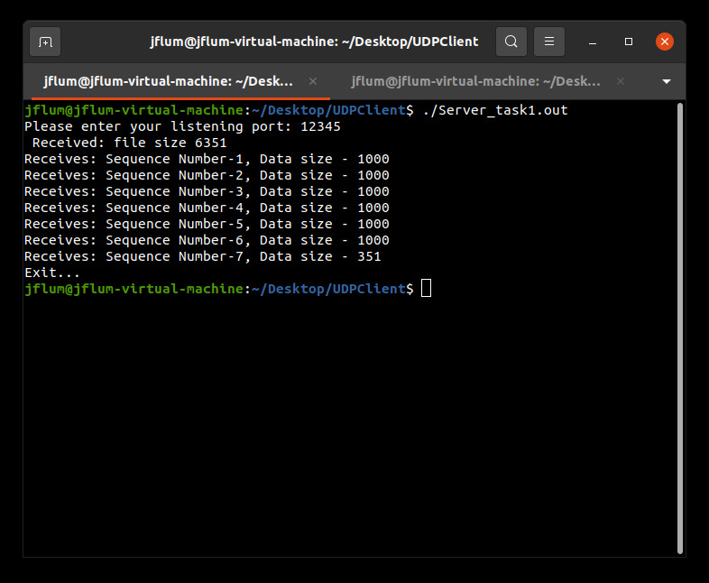
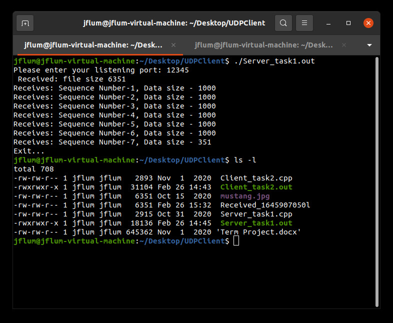

[Back to Portfolio](./)

Simple UDP Client
=================

-   **Class:** CSCI 332 - Applied Networking
-   **Grade:** A
-   **Language(s):** C++
-   **Video Demonstration:** [Watch on YouTube](https://youtu.be/H_QGWAo7pLw)
-   **Source Code Repository:** [jflum/udp_client](https://github.com/jflum/udp_client.git)  
    (Please [email me](mailto:jflum@csustudent.net?subject=GitHub%20Access) to request access.)

## Project description

Provided the corresponding User Datagram Protocol (UDP) server program, the Simple UDP Client allows for the efficient transmission of files over a specified socket (via a user-defined port and IP address). Files are split into binary data blocks of 1000 bytes, packaged, and sent to the server where they are then reassembled, producing an output file identical to the original.   

## How to compile and run the program

```bash
cd ./udp_client-1.01
g++ -o Server_task1 Server_task1.cpp
g++ -o Client_task2 Client_task2.cpp
./Server_task1
```
In a separate terminal:
```
cd ./UDPClient
./Client_task2
```

## UI Design

For this demonstration, I’ll be utilizing two terminals on the same machine: one running the server program and the other, the client. It should be noted that these programs function in the same manner if run on separate machines with shared network access, as is the practical application of a utility such as this. First, let’s run the server and specify our listening port as “12345” (or any other you may wish to use) (Fig. 1).

  
*Figure 1. Running the server program and entering a listening port.*

Next, we’ll start the client and specify a socket, using the same port previously identified and the server IP, in this case “127.0.0.1.” We can then enter the name of the file we would like to transfer; in this example, I have an image within the same directory named “mustang.jpg.” Once I hit enter, I receive a success message indicating that the file was sent (Fig. 2). 

  
*Figure 2. Running the client program and entering socket and file information.*

Switching back to the server terminal that was listening, we see information regarding the data that was sent (Fig. 3). For this particular file, the total file size was 6351 bytes, necessitating 7 packets, identified here as sequence numbers. Once the file is fully reassembled (after the final sequence), the program ends. To verify transfer, we can list our current directory which now contains a “Received_\<timestamp\>” file, which is identical to the original image, sans name/extension (Fig. 4).

  
*Figure 3. Viewing file transfer results of the server program.*
    
  
*Figure 4. Listing of our directory files after transfer has been completed.*

## Additional Considerations

Minimum requirements: GNU Compiler Collection (GCC) version 9.3.0.
```bash
sudo apt update
sudo apt install build-essential
```

[Back to Portfolio](./)
